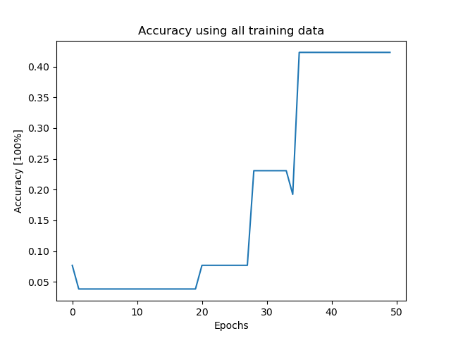
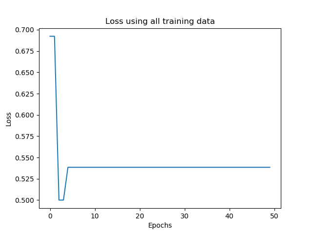
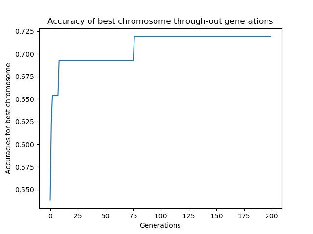
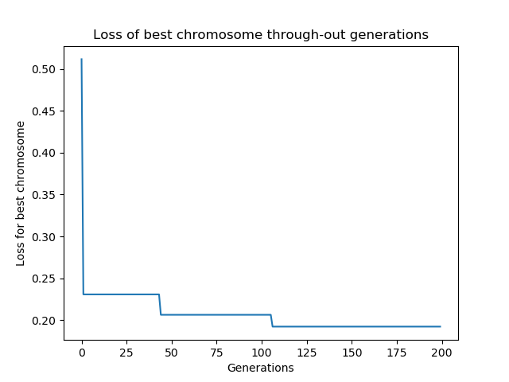

# Genetic Algorithm for Feature Selection

Given any dataset, it's well known that not every training sample delivers the same amount of information to the model.

I trained a genetic algorithm to improve accuracy and / or help a neural network converge faster, by selecting only training examples that help the network generalize better.

In the [WINE dataset](https://archive.ics.uci.edu/ml/datasets/wine) dataset used here, there are 3 classes and 157 training examples.

The method used is inspired by this [paper](https://link.springer.com/content/pdf/10.1007/978-3-642-34166-3_61.pdf):
1) Set the chromosome length to K (of 1's and 0's randomly drawn)
1) Select K components from each class (remove the 0's from the training data)
1) Train a population of networks N(N=50) epochs on these bootstrapped datasets (chromosomes) and test them on test data
1) Select top 2 chromosomes
1) Cross-over
1) Mutation
1) Create new population based on this offspring with mutation
1) Step 3 until convergence

## 
### Neural Network trained for 50 epochs on all training data
#### ***Accuracy***

#### ***Loss***

##
### Results after 200 generatons of training data selection
#### ***Accuracy***

#### ***Loss***
